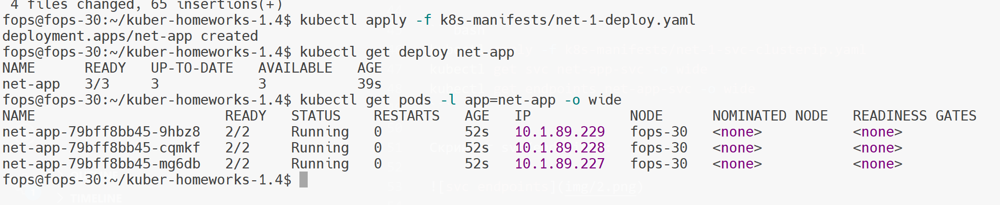
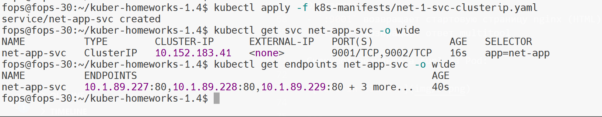
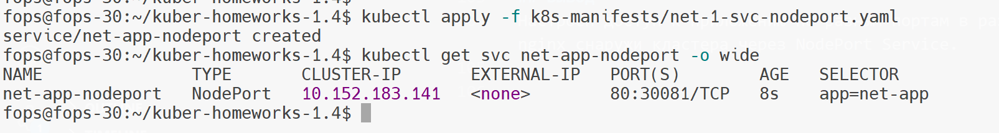
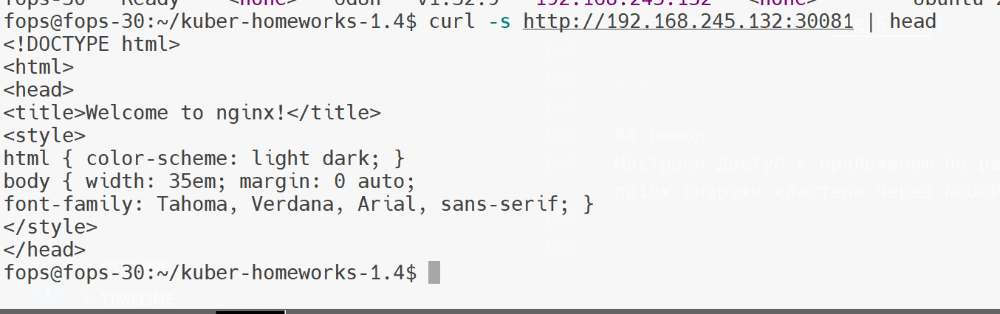

# Домашнее задание: «Сетевое взаимодействие в K8S. Часть 1»

## Цель задания
В тестовой среде Kubernetes обеспечить доступ к приложению (nginx + multitool) по разным портам в разные контейнеры — как внутри кластера, так и снаружи.

---

## Используемое окружение
- ОС: Ubuntu 24.04 (виртуальная машина)
- Kubernetes: MicroK8S
- Инструмент управления: kubectl

---

## Манифесты, используемые в работе
- [k8s-manifests/net-1-deploy.yaml](k8s-manifests/net-1-deploy.yaml)
- [k8s-manifests/net-1-svc-clusterip.yaml](k8s-manifests/net-1-svc-clusterip.yaml)
- [k8s-manifests/net-1-testpod.yaml](k8s-manifests/net-1-testpod.yaml)
- [k8s-manifests/net-1-svc-nodeport.yaml](k8s-manifests/net-1-svc-nodeport.yaml)

---

## Задание 1. Доступ внутри кластера по разным портам в разные контейнеры

### 1.1 Создание Deployment (3 реплики)
```bash
kubectl apply -f k8s-manifests/net-1-deploy.yaml
```

Проверка количества реплик/подов:
```bash
kubectl get deploy net-app
kubectl get pods -l app=net-app -o wide
```

Скриншот (реплик 3):



### 1.2 Создание Service (ClusterIP) с портами 9001 и 9002
Требование:
- 9001 -> nginx:80
- 9002 -> multitool:8080

```bash
kubectl apply -f k8s-manifests/net-1-svc-clusterip.yaml
kubectl get svc net-app-svc -o wide
kubectl get endpoints net-app-svc -o wide
```

Скриншот svc/endpoints:



### 1.3 Создание тестового Pod (multitool) и проверка доступа по DNS имени сервиса
```bash
kubectl apply -f k8s-manifests/net-1-testpod.yaml
kubectl get pod net-test -o wide
```

Проверка доступа из Pod по доменному имени сервиса:
```bash
kubectl exec -it net-test -- sh -c 'curl -s http://net-app-svc:9001 | head'
kubectl exec -it net-test -- sh -c 'curl -s http://net-app-svc:9002 | head'
```

Ожидаемо:
- `:9001` возвращает стартовую страницу nginx (HTML)
- `:9002` возвращает ответ multitool

Скриншот результата curl из Pod:


---

## Задание 2. Доступ снаружи кластера через NodePort

### 2.1 Создание Service типа NodePort для nginx
```bash
kubectl apply -f k8s-manifests/net-1-svc-nodeport.yaml
kubectl get svc net-app-nodeport -o wide
```

Скриншот NodePort сервиса:



### 2.2 Проверка доступа с локального компьютера/ВМ
Используется IP ноды (виртуальной машины) и NodePort из предыдущего шага.

Пример:
```bash
curl -s http://192.168.245.132:30081 | head
```

Скриншот результата (curl/браузер):



---

## Вывод
Настроен доступ к приложению по разным портам в разные контейнеры внутри кластера через ClusterIP Service, а также обеспечен доступ к nginx снаружи кластера через NodePort Service.

